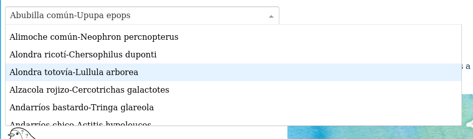
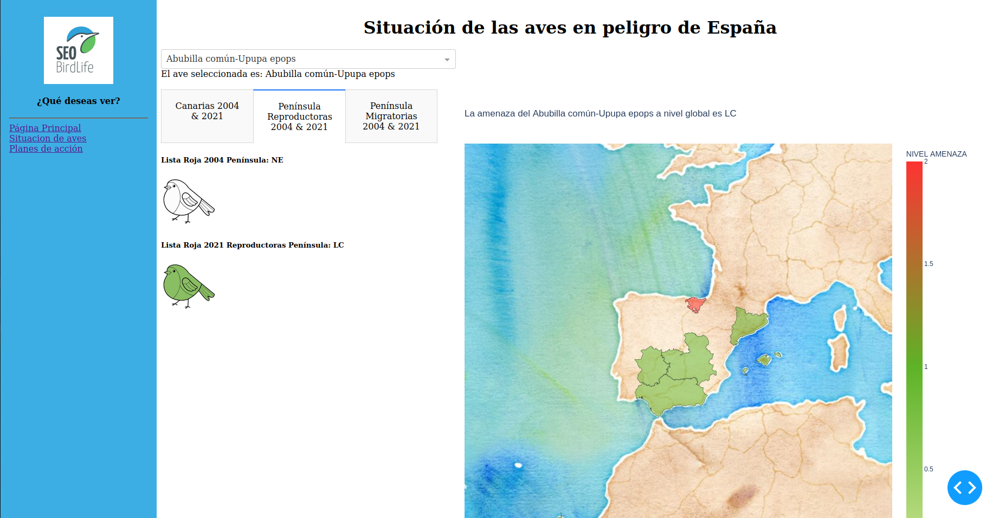

<h1 align="center">
	<p align="center">Tracking Aves</p>


# INSTALACIÓN

1. Clone este repositorio en la carpeta que desee.
```
git clone https://github.com/Factoria-F5-AI-Bootcamp-1-Edicion/Tracking_Aves.git
```
2. Se aconseja crear un entorno destinado para este proyecto. Por ejemplo con conda o venv.
3. Abra la terminal y ejecute:
```
pip install -r requirements.txt
```
4. Ya puede correr el programa. En su terminal y desde el directorio raíz ejecute:
```
python app/index.py
```

# INSTALACIÓN CON DOCKER

1. Clone este repositorio en la carpeta que desee.
```
git clone https://github.com/Factoria-F5-AI-Bootcamp-1-Edicion/Tracking_Aves.git
```
2. Instale docker en su computadora. Dependerá de su SO.
3. En la carpeta donde clonó el repositorio y desde su terminal, para crear la imagen ejecute:
```
sudo docker build -t dash_aves .
```
4. Cuando termine de construirse la imagen, corra la imagen con:
```
sudo docker run -p 8050:8050 dash_aves
```

# Plan de Acción y Catalogación de Recuperación de Especies a Nivel Estatal 

### El propósito principal de este proyecto tecnológico es simplificar, facilitar  y mejorar el proceso de búsqueda y categorización de las distintas especies de aves especialmente en España. Para ello, se han utilizado datos proporcionados por **SEO BirdLife** que contienen información detallada sobre todas las aves protegidas en las diferentes Comunidades Autónomas, incluyendo información sobre los planes de recuperación para aquellas especies en peligro de extinción, vulnerables o sensibles a la excepción de su hábitat. Asimismo, se ha desarrollado un listado a nivel estatal para una mejor catalogación de cada especie y su ubicación geográfica. Este proyecto busca contribuir a la implementación de los planes necesarios. 
<br>


# INTRODUCCIÓN 
### Nuestra plataforma de monitoreo de aves proporciona una forma fácil y eficaz de explorar y entender la situación de las aves en diferentes regiones. Gracias a las diferentes funciones, los usuarios pueden encontrar información detallada sobre diferentes especies de aves y explorar los datos a través de visualizaciones interactiva

<br>

# FUNCIONAMIENTO  

* Página principal: La página principal proporciona una vista general del proyecto y permite a los usuarios navegar a otras secciones de la plataforma.
<br>


* Situación de aves: La sección de Situación de Aves proporciona información detallada sobre el estado de las aves en diferentes regiones. 

<br>


<br>

* Selección del Listado de Aves: La función de Selección del Listado de Aves permite a los usuarios buscar y explorar diferentes especies de aves. Los usuarios pueden elegir buscar por nombre común, nombre científico.

<br>



<br>

* Informes 2004 - 2021: La sección de Informes proporciona información detallada sobre la situación de las aves en la Lista Roja, del año 2004 y el 2021. Los informes incluyen datos de población, tendencias de migración y amenazas.

<br>



<br>

* Mapa plan de Acción y Nivel de Amenazas: La sección de Mapa muestra la distribución geográfica de las diferentes especies de aves y proporciona información detallada sobre la categoria legal regional y estatal.

* Leyendas: La sección de Leyendas proporciona una explicación detallada de las diferentes categorias de las aves que se encuentran en el listado.

<br>


<br>

* Visualización de planes regionales: representación gráfica de los planes implementados y los que faltan por implementar. También se visualizan los planes caducados y los planes vigentes.

<br>


<br>

# TECNOLOGIAS USADAS
* Pandas
* Plotly
* Dash
* Folium
* Docker

<br>

# PARTICIPANTES 

* Nayare Montes (Scrum Master )
* Celeste López (Developer)
* Mayra Espinoza (Developer)
* Sebastian Degaudenci (Developer)


<br>

# PASOS PARA LA INSTALACIÓN EN NOTION

[Instalación](https://alive-ambert-19d.notion.site/Dashboard-de-aves-en-peligro-de-extinci-n-a5dc40d007db4cfd975a9bd673a3dc0e)


